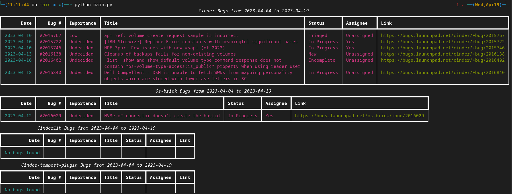

# Launchpad Bug Report




## Description
:coffee: Script to generate a list of bugs from today minus the days you want :coffee

## Quick Start

### Setup virtual environment
```
python3 -m venv myenv
source myenv/bin/activate
pip install -r requirements.txt
```

### Run the script

```
cp env.sample .env
python main.py
```


## Contributing
Contributions are what make the open source community such a great place for learning, inspiration and creativity. Any contribution you make is greatly appreciated.

## Acknowledgments
- I found the following articles very interesting, maybe they are interesting for you too. [Stop using utcnow and utcfromtimestamp](https://blog.ganssle.io/articles/2019/11/utcnow.html)

- I would like to thank Schwuk. [Simple script to slurp bugs from a Launchpad project into Pivotal Tracker stories.](https://gist.github.com/schwuk/517279/a26dcbb59fb151e3ef00d84f2977a6c2355363d2)

- [Launchpad Api Doc](https://launchpad.net/+apidoc/1.0.html)
